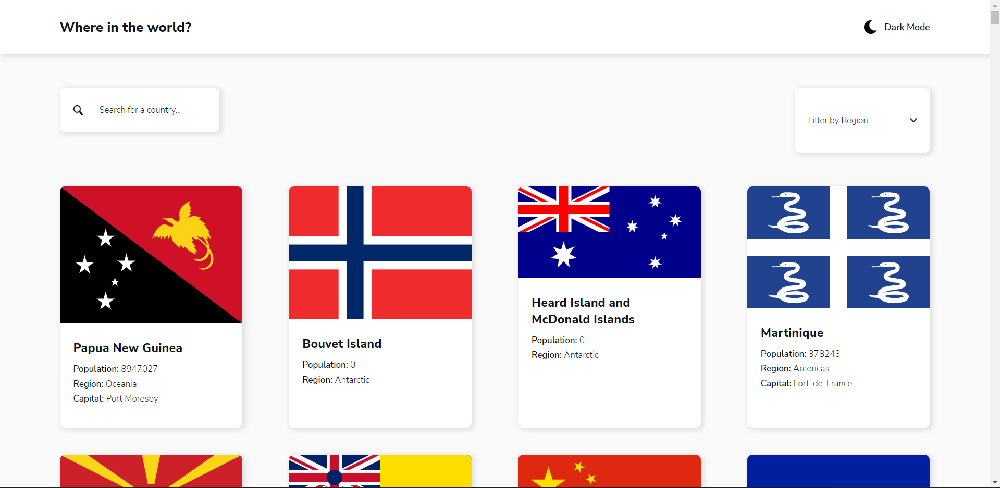

# Country Finder

## Índice

- [Sobre](#sobre)
- [Screenshots](#screenshots)
- [Links](#links)
- [Para desenvolvedores](#para-desenvolvedores)
  - [Rodando localmente](#rodando-localmente)
  - [Licença](#licença)

### Sobre

Página com uma listagem de todos os países existentes no globo, com mecanismo de filtragem por nome e por continente, tal como uma página separada para visualização de detalhes mais específicos do país.

A página também possui um esquema de temas, podendo variar do tema dark para o tema light apenas com o clique de um botão no cabeçalho da página.

### Screenshots



### Links

Visualize a página através desse [link](https://country-finder-whoiscaio.vercel.app/).

## Para desenvolvedores

### Tecnologias

HTML - Linguagem de marcação para estruturação da página.
CSS - Linguagem de estilização para definição de estilos aos elementos.
Typescript - Linguagem de programação baseada em Javascript com tipagens.
React - Framework Javascript para o desenvolvimento de UIs reativas.
Context API - Biblioteca React para a manipulação de estados globais.
Redux / Redux Toolkit - Biblioteca React para o gerenciamento de estados globais.
Styled-Components - Biblioteca React para a criação de componentes estilizados.

### Rodando localmente

Clone o projeto

```bash
  git clone https://github.com/whoiscaio/country-finder
```

Entre no diretório do projeto

```bash
  cd country-finder
```

Instale as dependências

```bash
  npm install
```

Inicie o servidor

```bash
  npm run start
```

### Licença

[MIT](https://choosealicense.com/licenses/mit/)
