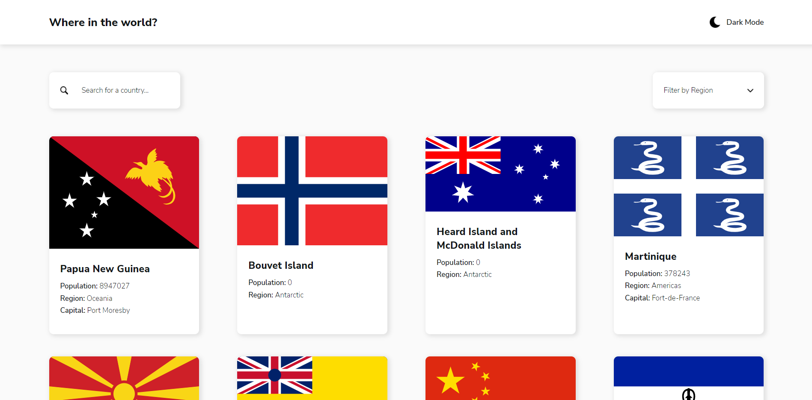

# Frontend Mentor - REST Countries API with color theme switcher solution

This is a solution to the [REST Countries API with color theme switcher challenge on Frontend Mentor](https://www.frontendmentor.io/challenges/rest-countries-api-with-color-theme-switcher-5cacc469fec04111f7b848ca).

## Table of contents

- [Overview](#overview)
  - [The challenge](#the-challenge)
  - [Screenshot](#screenshot)
  - [Links](#links)
- [My process](#my-process)
  - [Built with](#built-with)
  - [What I learned](#what-i-learned)
  - [Useful resources](#useful-resources)
- [Author](#author)

## Overview

### The challenge

Users should be able to:

- See all countries from the API on the homepage
- Search for a country using an `input` field
- Filter countries by region
- Click on a country to see more detailed information on a separate page
- Click through to the border countries on the detail page
- Toggle the color scheme between light and dark mode *(optional)*

### Screenshot

#### Desktop Version

#### Mobile Version

### Links

- Solution URL: [Github Repository](https://github.com/whoiscaio/country-finder)
- Live Site: [Vercel](https://country-finder-whoiscaio.vercel.app/)

## My process

### Built with

- Semantic HTML5 markup
- CSS custom properties
- Flexbox
- [React](https://reactjs.org/) - JS library
- [Styled Components](https://styled-components.com/) - For styles
- [Typescript](https://www.typescriptlang.org/) - Javascript with type syntax

### What I learned

This one was my very first project using Typescript. It was definitely an amazing experience, i've been learning Typescript for almost a month and to be able to build a complete project with it is an incredible sensation. I learned a lot about this language, mainly how to use it with other React tools such as Styled Components and Axios (typing the request expected values interface).

### Useful resources

- [Theme with Styled Components and Typescript](https://medium.com/rbi-tech/theme-with-styled-components-and-typescript-209244ec15a3) - This article was very important during the development process to overcome some typing issues that i had with using styled-components on a typescript project.

## Author

- Github - [@whoiscaio](https://www.github.com/whoiscaio)
- Linkedin - [Caio Lima](https://www.linkedin.com/in/lima-caio)
- Frontend Mentor - [@whoiscaio](https://www.frontendmentor.io/profile/whoiscaio)
